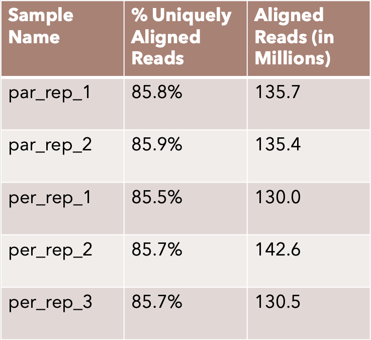
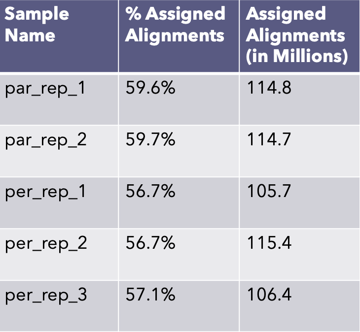

# Breast Cancer Persister Cell Single Cell RNA Seq Data Analysis

## Introduction
Persister Cells are a cancer subpopulation ***responsible for recurrent cases of cancer*** within patients who are initially deemed cancer-free. They primarily operate in a dormant (low metabolism) phase, which enables them to escape treatments seeking to target common cell metabolism & growth processes. They live in a competitive tumor microenvironment which acts as a medium of balance between the persister cell population and the cancer stem-like cell population. This balance is shifted when there is a drastic decrease in either population which results in stimulation of the production of either cell population. Because persister cells appear to be activated during high cellular stress situations, I hoped to identify the key stress pathways that activate the persister cell subpopulation and subsequently maintain this cell subpopulation. Currently, the best treatment for breast cancer persister cells is inhibition of GPX4 gene, which induces an inability for the cells to handle oxidative stress. However, I believe if these stress pathways and core differential genes of these pathways are identified, inhibition of these factors can serve as another pathway to slow and prevent the growth of these persister cells.

To do so, I will analyze the single-cell RNA-seq data of 2 non-persister or parental replicates and 3 persister cell replicates. Since this dataset is available on NCBI as FASTQ files, I will need to extract the raw gene expression counts by creating Bash scripts definining data processing pipelines leveraging tools such as STAR ALIGNER and FeatureCounts. These Bash scripts enable me to submit my jobs to SLURM, which will allocate the required computational resources to execute my pipelines on the HPC (High Performance Computing) clusters. Lastly, I would like to thank Dr. Hannah Carter and her lab group who answered all of my questions, helped me debug issues, and made me a better researcher. 

## Data Processing Workflow: FASTQs to Raw Gene Expression Counts
As a preface, this is all work done on HPC clusters via SLURM and bash job scripts leveraging tools: STAR ALIGNER & FeatureCounts

1. Download Raw Reads as FASTQs
2. Align the FASTQs to the Reference Genome via STAR ALIGNER

Above figure indicates overall high read alignment success, increasing confidence in the high-quality nature of sequencing data

3. Obtaining Raw Counts of Gene Expression Levels via FeatureCounts

Above figure indicates great read assignment, increasing confidence in reads mapping to reference genome & high quality nature of sequencing data
## Data Processing Workflow: Normalization and Annotation of Raw Gene Expression Counts for Pathway Analysis
To conduct the persister cell pathway analysis, I will be leveraging an R package called PROGENy, a pathway analysis tool that outputs pathway activity scores for the 14 major pathways responsible for cell growth, cell survival, celluar stress response, etc. This tool is essentially a matrix containing 100 ***Core Pathway Responsive Genes*** (identified from 568 perturbed pathway experiments) for each of the 14 pathways. Each of these ***Core Pathway Response Genes*** have their respective Z-score determined from these perturbed pathway experiments. The user provides a dataframe with genes identified by their HGNC symbols as the index and the normalized gene expression counts for each of the replicates in the respective replicate columns. The output will be 14 pathway scores (representing activity usage within the replicate) Z-score normalized along each of the pathways, giving insight into usages of the pathways relative to the different replicates.

1. Filter out genes with 0 reads across all replicates (2 non-persister and 3 persister)
2. Convert current Ensembl IDs to HGNC symbols for all genes
3. Combine gene expression of genes with multiple Ensembl IDs
4. Apply a Variance Stabilizing Transformation to normalize the gene expression data
5. Use normalized data for PCA to confirm replicates
6. Transform data into suitable input for PROGENy
7. Create heatmap of outputted pathway activity scores from PROGENy

